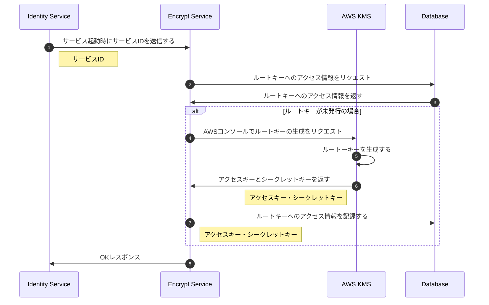
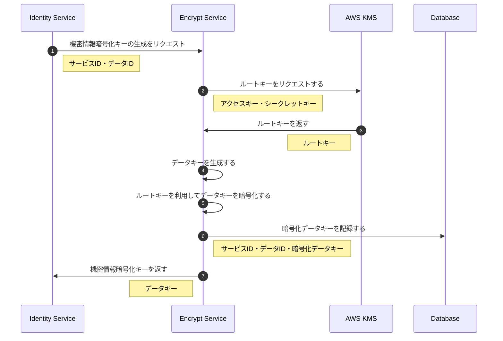
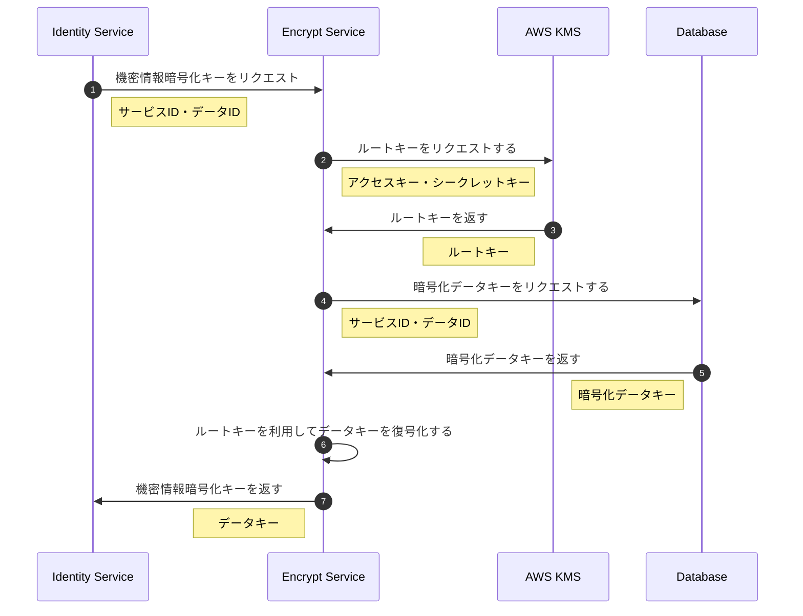

# Inaba Encrypt Service
## Encrypt Serviceでやりたいこと
ユーザーの機密情報などを取り扱うに当たってAxon Frameworkとの相性の悪さを解消することを目的としたサービス  
Axon Frameworkは過去のイベントをすべて記録するため、機密情報が含まれたレコードが記録された場合であっても削除することができない問題がある  
Encrypt Serviceで機密情報を暗号化することで機密情報をイベントに記録することができるようになる  
また、AWS KMSを利用したエンベローブ暗号化を行うことで暗号化キーの管理を容易にし、安全かつメンテナンスしやすいシステムの構築を目指すことができる

## ルートキー処理シーケンス

## データ暗号化処理シーケンス

## データ復号化処理シーケンス

## 参考
- [AWS Key Management Service 開発者ガイド - エンベローブ暗号化](https://docs.aws.amazon.com/ja_jp/kms/latest/developerguide/concepts.html#enveloping)